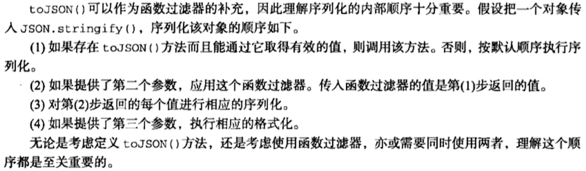

#JSON.stringfy 和 JSON.parse（待续）

支持全局对象JSON的浏览器有：IE8+, FireFox3.5+, Safari4+, Chrome, Opera10.5+

##JSON.stringfy(obj, array|replacerFunction, indentValue|indentString)

用于把JavaScript对象序列化为JSON字符串。详细用法见《JavaScript高级程序设计》（第三版）20.2.2节。

**序列化顺序：**

##JSON.parse(jsonText, reviverFunction)

