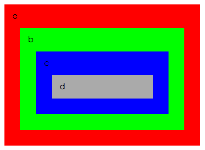

#event.target 和 event.currentTarget 的区别

##举例说明：

;

```html
<!DOCTYPE html>
<html>
<head>
    <title></title>
    <style>
        div {
            margin: 1rem;
            padding: 1rem;
        }

        #a {background-color: #f00;}
        #b {background-color: #0f0;}
        #c {background-color: #00f;}
        #d {background-color: #aaa;}
    </style>
</head>
<body>
    <div id="a">a
        <div id="b">b
          <div id="c">c
            <div id="d">d</div>
          </div>
        </div>
    </div>

    <script>
        function logTarget(e) {
            console.log('target:' + e.target.id + ' & currentTarget:' + e.currentTarget.id);
        }

        document.getElementById('a').addEventListener('click', logTarget, false);
        document.getElementById('b').addEventListener('click', logTarget, false);
        document.getElementById('c').addEventListener('click', logTarget, false);
        document.getElementById('d').addEventListener('click', logTarget, false);
    </script>
</body>
</html>
```

当点击d的时候，输出：

```
target:d & currentTarget:d
target:d & currentTarget:c
target:d & currentTarget:b
target:d & currentTarget:a
```

当点击b的时候，输出：

```
target:b & currentTarget:b
target:b & currentTarget:a
```

##结论

- target始终指向注册eventListener时的element，固定不变；
- currentTarget在事件捕获或者事件冒泡过程中，指向当前的element，会不断变化。


